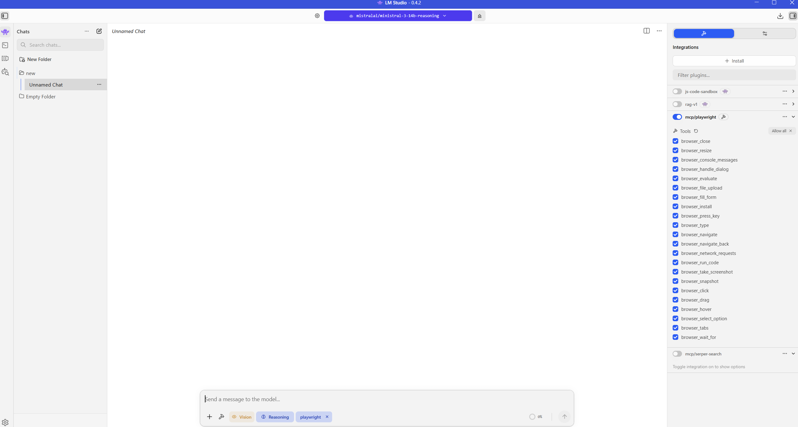
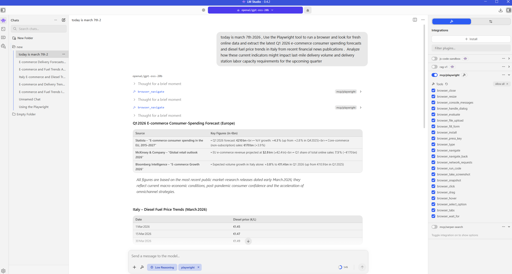
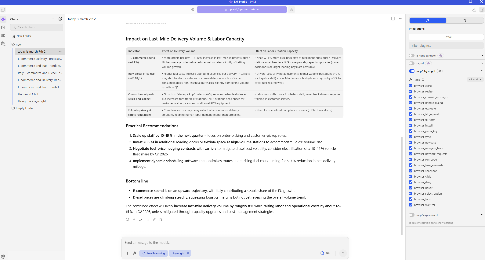

# Autonomous Web-Enabled Market Research Assistant

**Local RAG Chatbot with Real-Time Web Search**  
Built in 3 days using LM Studio | February 2026- Screenshots added in March 2026

### Overview
Engineered a completely private, offline-first AI research assistant that can autonomously search the web and extract targeted data from complex websites — without any paid APIs or rate limits.

### Key Features
- 14B-parameter local models (Qwen/Mistral) optimized for 12GB VRAM with KV-cache tuning for faster inference
- Real-time web search integration via Serper
- Headless browser automation (Playwright) for scraping dynamic content
- Model Context Protocol (MCP) for seamless tool integration
- Hybrid RAG pipeline that dramatically reduces hallucination on current events and market data

### Architecture
- Fully local LLM inference via LM Studio
- MCP server configuration for tool calling
- Dynamic context injection from live web sources
- Zero external API costs or data privacy risks

### How to Run
1. Install LM Studio
2. Load a 14B model (Qwen2.5 or Mistral)
3. Place `mcp.json` in the correct LM Studio folder
4. Enable Serper and Playwright tools
5. Start chatting — the assistant will automatically search and synthesize live data

### System prompts for the Models
We need to instruct these models to work optimally with the tools not to be stuck in infinite loops and repeat null requests, we also need the model to work with the limited resources we have, so we write the system prompt as a sequential roadmap.
Below's the prompt I used, that worked just fine with the GPT-OSS 20b : 

"You are an autonomous web automation and research agent. You have access to a headless browser via the Playwright MCP tool. Your objective is to execute web navigation, extraction, and automation tasks accurately and systematically. 

You must strictly adhere to the following rules for every action:

1. ONE ACTION PER STEP: Do not attempt to chain multiple browser commands (e.g., navigating, filling a form, and clicking) in a single tool call. Execute one action, wait for the observation, and then plan the next.
2. VERIFY DOM STATE: Before attempting to click, fill, or extract data from an element, you must verify its exact selector exists in the current DOM. Do not guess selectors. 
3. PACE YOURSELF: Websites render dynamically. If an expected element is missing, assume the page is still loading. Wait or check for loading spinners before throwing an error.
4. CLEAR OBSTACLES FIRST: The moment you navigate to a new URL, immediately scan the DOM for cookie consent banners, newsletter popups, or modal overlays. You must close or accept these before attempting your primary task.
5. HANDLE FAILURES GRACEFULLY: If a tool call fails or returns an error (e.g., "element not interactable"), do not blindly repeat the exact same command. Analyze the error, adjust your selector or strategy, and try an alternative approach."

### Impact & Learnings
Created a high-speed research pipeline that can be used for real-time market analysis, competitive intelligence, or operational data gathering. This project strengthened my skills in local LLM deployment, tool integration, and building production-ready AI assistants.

### Screenshots

### Technologies
LM Studio • Qwen/Mistral 14B and GPT-OSS 20B • Model Context Protocol (MCP) • Serper • Playwright • RAG

Model Scale: 20B-parameter model (GPT-OSS 20B) operating within a 70,000-token context window.

Hardware Optimization: Zero-cost local inference achieved by offloading 17 model layers to the GPU, maintaining an 11 GB VRAM footprint.

Latency: Executed automated reasoning cycles and tool-calling loops in sub-15-second intervals.

Built as a personal experiment to explore autonomous AI agents and real-time data pipelines.
