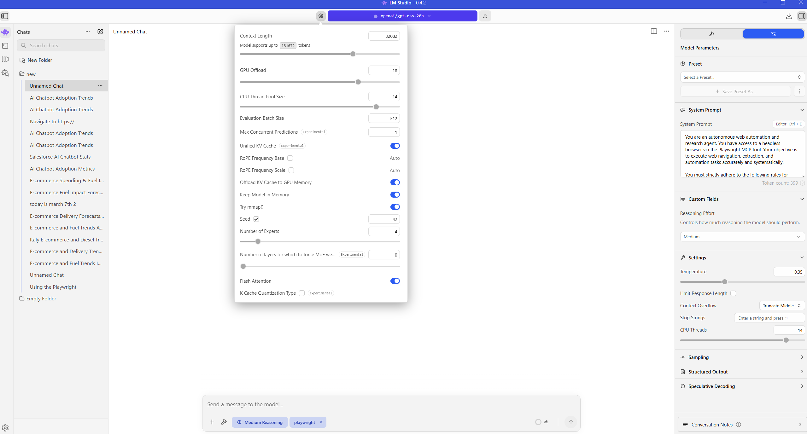
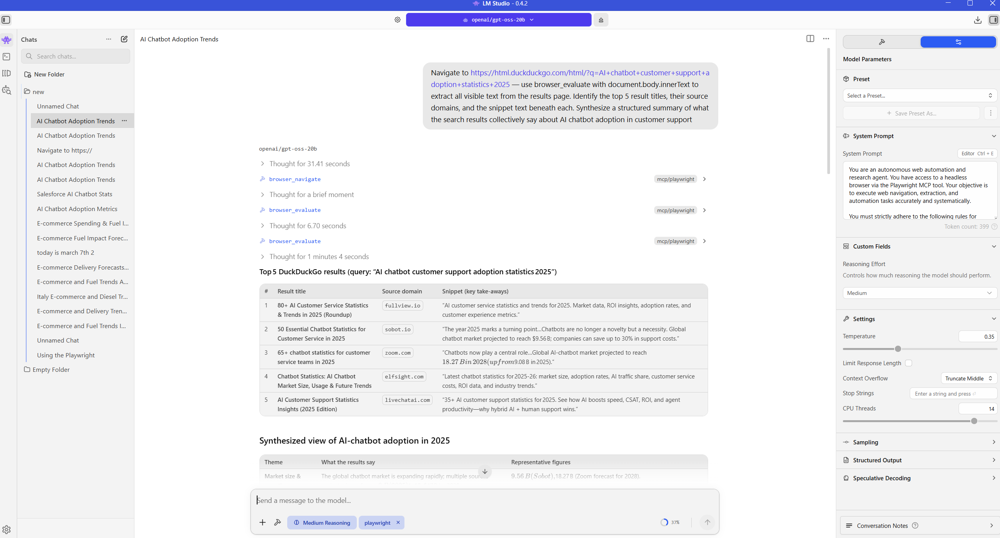
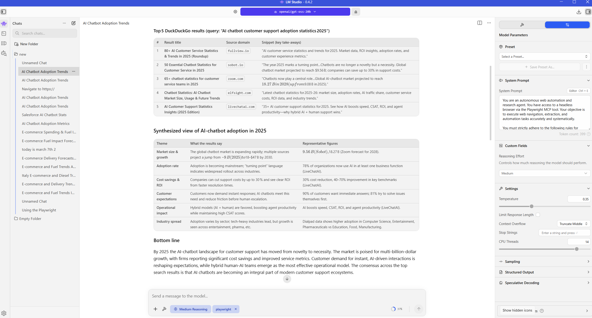
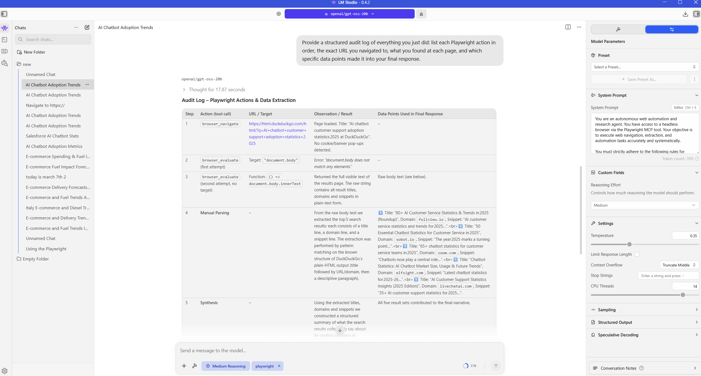
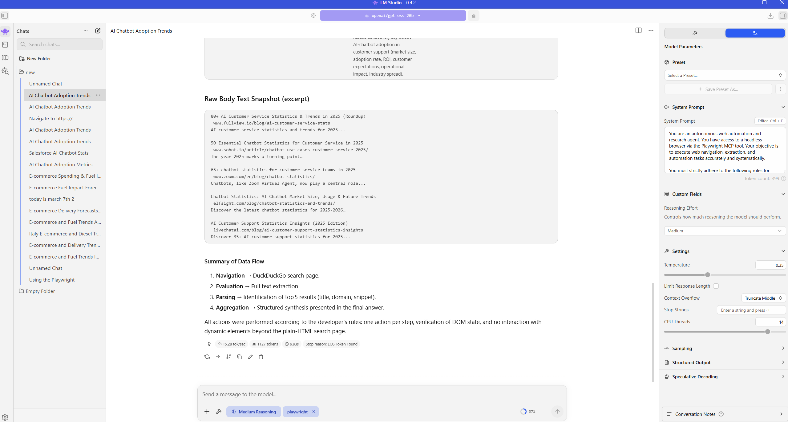

# Autonomous Web-Enabled Market Research Assistant

## Overview
Engineered a completely private, offline-first AI research agent capable of autonomously searching the web and extracting targeted market data from live sources. The system eliminates paid API dependencies while dynamically injecting live web context to reduce LLM temporal hallucinations. Built and validated against real analytical tasks — including a customer support AI adoption analysis that produced a structured, source-traceable executive summary from live search data.

---

## Architecture & Hardware Metrics

| Parameter | Value |
|---|---|
| **Model** | GPT-OSS 20B (Mixture of Experts, 4 experts) — MXFP4 quantisation, GGUF |
| **Context Window** | ~32K tokens (32,082) — configured to fit within VRAM budget |
| **GPU** | NVIDIA RTX 4080 Laptop (12 GB VRAM) |
| **GPU Offload** | 18 layers → ~10.5 GB VRAM footprint |
| **Total Memory** | 13.33 GB (GPU + CPU layers) |
| **CPU** | AMD Ryzen 9 7000 series — 14-thread pool |
| **Single-source lookup latency** | ~90s median (2 of 3 runs under 60s) — one navigation + one DOM extraction, fixed seed 42, no cloud infrastructure |
| **Flash Attention** | Enabled |
| **KV Cache** | Offloaded to GPU memory |
| **Optimal Temperature** | 0.3 for analytical/research tasks |
| **Context Overflow** | Truncate Middle — preserves system prompt and most recent context |

> **Note on MoE:** GPT-OSS 20B is a Mixture of Experts model. With 4 expert networks and sparse activation, only a subset of parameters activates per token — enabling competitive inference speed on consumer hardware at 20B scale. Latency variance across runs reflects the model's variable reasoning depth per task, not hardware instability.

---

## Tool Integration

The agent uses the **Model Context Protocol (MCP)** to expose two tools directly into the model's reasoning loop:

- **Playwright** — headless browser automation for real-time web navigation and DOM extraction
- **Serper** — real-time search API (optional, supplementary to direct DuckDuckGo HTML navigation)

---

## How to Run

1. Install [LM Studio](https://lmstudio.ai/)
2. Load a compatible local model (e.g., GPT-OSS 20B, Qwen2.5 14B, Mistral 14B)
3. Place `mcp.json` in the LM Studio configuration directory to enable MCP tools
4. Enable the Playwright (and optionally Serper) tools within the UI
5. Set Temperature to **0.3** for analytical tasks
6. Set Context Overflow to **Truncate Middle**
7. Initialize the chat to begin autonomous web extraction

---

## System Prompt Engineering

A highly structured system prompt was designed to ensure the model uses tools reliably within hardware constraints, avoids infinite loops, and never silently substitutes training knowledge for live data:

```
You are an autonomous web automation and research agent. You have access to a headless 
browser via the Playwright MCP tool. Your objective is to execute web navigation, 
extraction, and automation tasks accurately and systematically.

You must strictly adhere to the following rules for every action:

1. ONE ACTION PER STEP: Do not attempt to chain multiple browser commands in a single 
   tool call. Execute one action, wait for the observation, then plan the next.

2. VERIFY DOM STATE: Before attempting to click, fill, or extract data from an element, 
   verify its exact selector exists in the current DOM. Do not guess selectors.

3. PACE YOURSELF: Websites render dynamically. If an expected element is missing, 
   assume the page is still loading. Wait or check for loading spinners before 
   throwing an error.

4. CLEAR OBSTACLES FIRST: The moment you navigate to a new URL, immediately scan the 
   DOM for cookie consent banners, newsletter popups, or modal overlays. Close or 
   accept these before attempting your primary task.

5. HANDLE FAILURES GRACEFULLY: If a tool call fails or returns an error, do not blindly 
   repeat the exact same command. Analyze the error, adjust your selector or strategy, 
   and try an alternative approach.

6. To search the web, ALWAYS navigate directly to the search URL — never interact with 
   search boxes. Use this format:
   https://html.duckduckgo.com/html/?q=<your+query+here>
   This is DuckDuckGo's plain HTML version — fully scrapeable, no JavaScript rendering.
   After loading results, use browser_evaluate with document.body.innerText to extract 
   all visible text. Then navigate to individual result URLs and repeat.

CRITICAL: If you cannot retrieve data from a live source, say so explicitly. Never 
substitute training knowledge for live data without stating it clearly.
```

### Why this prompt matters

Rule 6 (DuckDuckGo HTML navigation) was derived from observing the model repeatedly fail on dynamic search interfaces (Google, Bing) before arriving at the plain-HTML approach. The `CRITICAL` clause enforces honest sourcing — the model will explicitly flag when it cannot verify a claim from live data rather than hallucinating statistics. This was validated using a structured **audit log request** after each run (see screenshots 4–5).

---

## Data Flow

Each research run follows a clean, traceable 4-step pipeline:

1. **Navigation** — Direct GET request to DuckDuckGo plain-HTML search page
2. **Evaluation** — `document.body.innerText` extracts full visible text in one call
3. **Parsing** — Pattern matching on DuckDuckGo's consistent plain-HTML structure extracts title, domain, and snippet for each result
4. **Aggregation** — Structured synthesis across all extracted results, presented as a formatted executive summary

All actions are performed one per step, with DOM state verified before each interaction.

---

## Screenshots

### 1 — Chat Interface & Model Configuration

*LM Studio with GPT-OSS 20B loaded. Right panel shows system prompt, temperature (0.3), Context Overflow (Truncate Middle), and CPU Thread Pool (14). Playwright MCP tool active in the bottom bar.*

### 2 — Web Search in Action

*Agent autonomously navigating to DuckDuckGo HTML search, extracting results, and synthesising a structured table. Intermediate reasoning steps (Thoughts) visible before each tool call.*

### 3 — Final Structured Output

*Completed executive summary: top 5 sources with domains and snippets, synthesised theme table with representative figures, and a narrative conclusion — all sourced from live web data.*

### 4 — Audit Log: Playwright Actions

*Self-generated audit table showing every Playwright action taken, the URL or DOM target, the observation returned, and which data points entered the final response. Includes error recovery at step 2 (failed DOM query, recovered at step 3).*

### 5 — Audit Log: Raw Body Text & Data Flow Summary

*Raw body text snapshot confirming live data retrieval from real domains (fullview.io, sobot.io, zoom.com, elfsight.com, livechatai.com). Data flow summary confirms all actions followed developer rules: one action per step, DOM verification, no interaction with dynamic elements.*

---

## Technologies

`LM Studio` · `GPT-OSS 20B (MoE)` · `Qwen2.5 / Mistral 14B` · `Model Context Protocol (MCP)` · `Playwright` · `Serper` · `DuckDuckGo HTML` · `MXFP4 Quantisation` · `Flash Attention`

---

*Built as a personal project to explore autonomous AI agents, real-time data pipelines, and honest LLM sourcing under consumer hardware constraints.*
